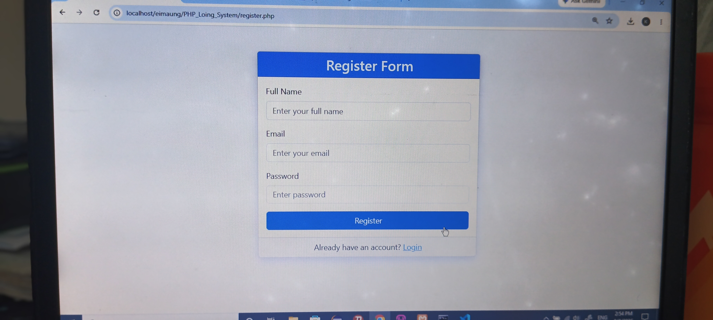
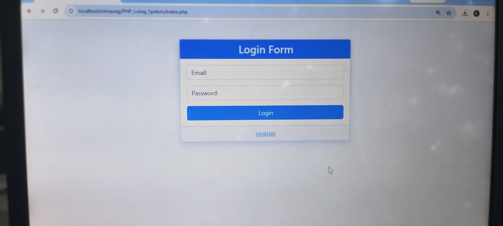
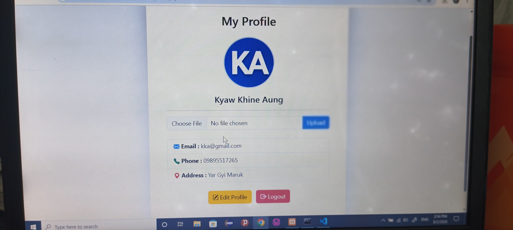

# PHP Login System

A simple authentication system built with PHP, MySQL and Bootstrap.

## Features

- User Registration
- User Login
- User Logout
- Password Hashing (password_hash)
- Session Authentication
- Edit Profile
- Upload Profile Picture
- MySQL Database
- Prepared Statements (SQL Injection Protection)

## Technologies

- PHP
- MySQL
- Bootstrap 5
- HTML
- CSS

## Project Structure

project/
│
├── actions/
├── config/
├── photos/
├── asset/
├── index.php
├── register.php
├── profile.php
├── edit-profile.php
├── README.md
├── .gitignore

## Installation

1. Clone repository

git clone https://github.com/Kyaw-Khine-Aung-ucss/php-authentication-system

2. Copy project to htdocs

3. Import auth_system.sql

4. Start Apache and MySQL

5. Open

http://localhost/PHP_Login_System

## Future Features

- Change Password
- Forgot Password
- Email Verification
- Admin Dashboard

## Screenshots

## Future Features

- Change Password
- Forgot Password
- Email Verification
- Admin Dashboard

## Author

Kyaw Khine Aung